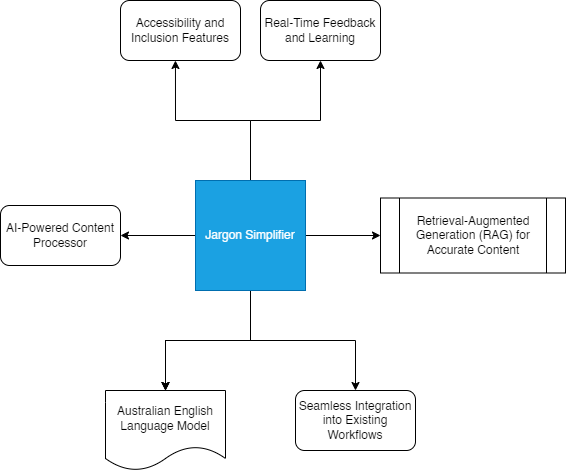
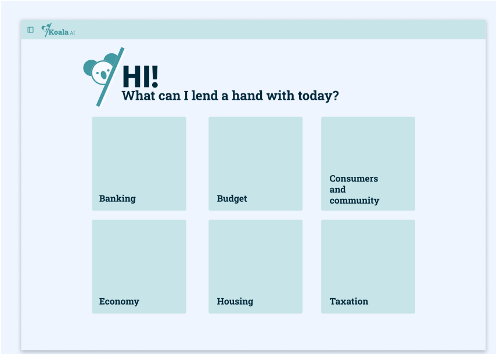

This is readme for project that demonstrates a fully working solution for GovHack challenge **"Use AI to transform bureaucratic jargon into plain English"**

The link for the challenge can be found [here](https://hackerspace.govhack.org/challenges/use_ai_to_transform_bureaucratic_jargon_into_plain_english).

### Problem Statement:
How can we use AI to create clear, accurate and user-friendly government content? Specifically, how can we use AI tools to apply Australian Government Style Manual (Style Manual) rules and guidelines to create, edit and review content?
Content that is clear, accurate and understandable helps people make informed decisions and comply with their obligations.

### Solution:
This solution aims to leverage AI to transform bureaucratic government content into clear, accurate, and user-friendly information. The focus is on operationalizing the Australian Government Style Manual's guidelines, improving inclusivity, accessibility, and accuracy, while integrating AI into existing workflows for measurable benefits.

### Fully Functional Demo App:
You can access fully functional application at [**KoalaAI**](https://dev.digionboard.centelon.com/govhack)

The app demonstrates certain use cases of simplifying jargon related to Australian Treasury and Public Service Commission resources.

Examples are as follows -

**Budget:**
Key findings from the federal budget 2024 Australia

Questions
1. Summarise key impacts from Australian federal budget 2024 on small businesses
2. What is being done to help with the rising costs of housing, groceries, and energy bills

**Banking Code Of Practice:** The Code sets out the standards of practice and service in the Australian banking industry for individual and small business customers, and their guarantors.

Questions
1. What are my rights as an elderly, less literate citizen of western Australia regarding banking services
2. How does the Code ensure fairness in resolving disputes between banks and customers?

**Royal Commission:**
The Royal Commission inquiry into misconduct in the Banking, Superannuation and Financial Services Industry.

Questions 
1. Why did regulatory bodies (ASIC, APRA) fail to detect and act on financial misconduct sooner? 
2. Will there be a review of all financial products and services currently being offered to ensure they meet consumer needs?

**WHS:** A regulatory framework to protect the health, safety and welfare of workers

Questions
1. What are key provisions policy related to asbestos related risks 
2. Provide summary of key provisions regarding storage of hazardous materials

### Target State Design System:

This [document](koala%20AI%20Design%20System.pdf) outlines target state design system for the app.

### Solution Approach
Detailed Solution approach can be found in this [document](AI-Driven Content Transformation for GovHack.pdf).
Thankful to [Centelon Pty Ltd.](https://www.centelon.com) for kindly allowing to use [METIZ Zero Code Platform](https://metiz.ai/) to get the fully working app up and running just in two days!

